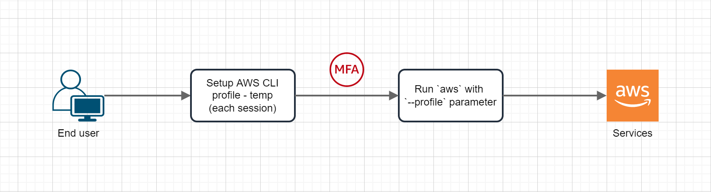
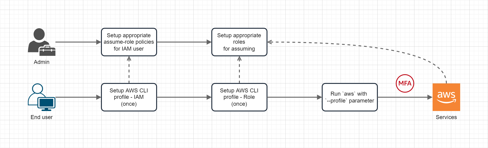

# aws-cli-mfa-profile.ps1

### Purpose
Create a temporary session from main AWS access/secret key pair and MFA token. The session then is configured as an AWS profile for CLI, SDK and API usage. Profile contains:
- A pair of AWS access/secret key for the temporary session.
- A token of the session.

##### Diagram:


*Temp configured profile (called **MFA profile**) can be also set to `AWS_PROFILE` environment variable for convenience. You can run `aws` command without having to provide `--profile` parameter.*

### Run
```powershell
.\aws-cli-mfa-profile.ps1
```

##### Inputs:
1. Access key ID: Your (main) AWS access key ID.
2. Secret access key: Your (main) AWS secret access key.
3. Region: AWS region for MFA profile.
4. Output: AWS output for MFA profile.
5. MFA profile name: [Optional] Name for the MFA profile. If you skip this, a random name `mfa-<6-character-string>` will be used.
6. Set env? (Y/Yes/N/No): Set profile name above to AWS_PROFILE env variable.
7. Time-to-live (1-12 hours): Session timeout.
8. MFA ARN: Your MFA virtual/hardware device ARN.
9. MFA token: Token from your MFA virtual/hardware device.

\* *You can directly declare input 1-8 into the script so you don't have to provide at the prompt each run.*

### References:
- https://docs.aws.amazon.com/cli/latest/userguide/cli-configure-profiles.html
- https://aws.amazon.com/premiumsupport/knowledge-center/authenticate-mfa-cli/

### Alternatives:
- AWS CLI MFA with Assume-Role profile
  - Diagram: 
  - Reference: https://docs.aws.amazon.com/IAM/latest/UserGuide/id_roles_use_switch-role-cli.html